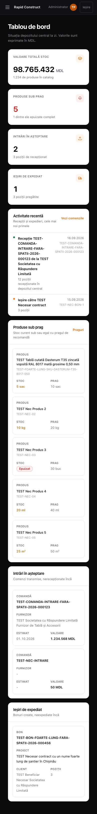
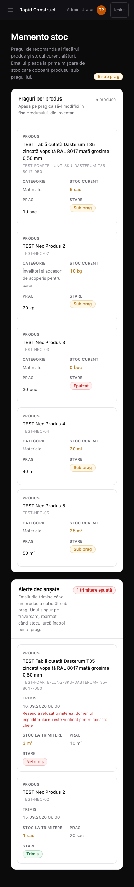
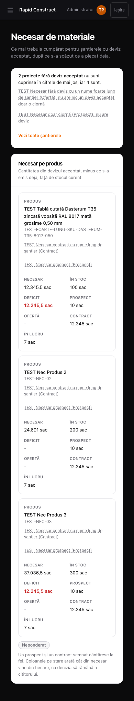
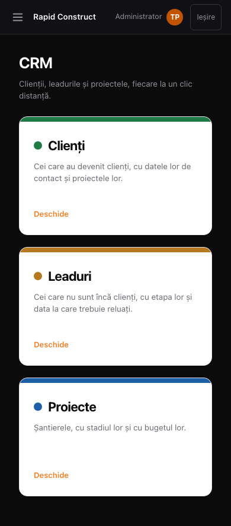
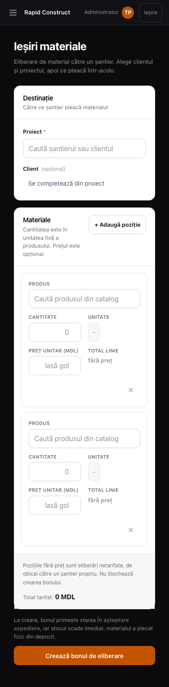
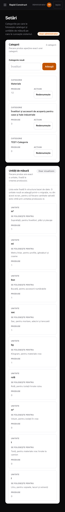
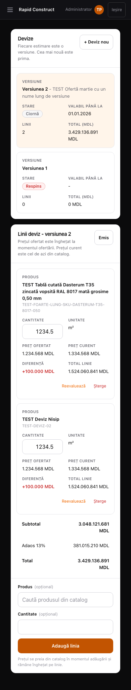
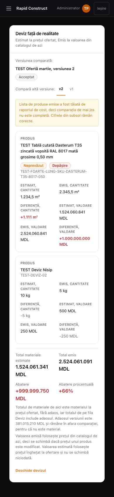
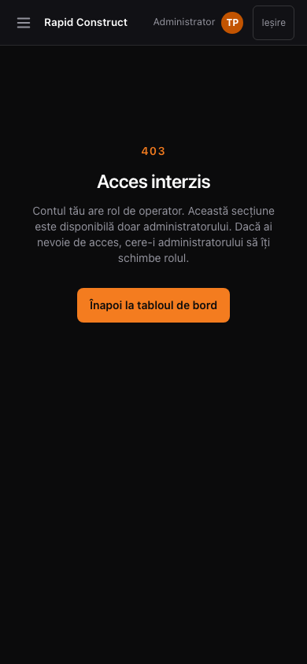

# Executor report: G23 part 4, the remaining screens on a phone (P3-67)

Date: 2026-09-16. Role: AUTHOR (card P3-67), then EXECUTOR. Lane B (BLUE): branch pushed, no pull request.
Branch: `card/p3-67`.

## In plain words

The dashboard, Memento stoc, Necesar, the CRM landing screen, the material issue form (Ieșiri
materiale), Setări, a project's Deviz and Comparație tabs and the "access denied" screen now fit a
390 px phone: blocks sit one under the other, every table row becomes a small card with its column
name above each value, buttons and fields are finger-sized (44 px) and fields use 16 px text so an
iPhone does not zoom in. Nothing changes on a computer. With parts 1 to 3 this is the last part of
the phone layout goal.

**No migration was added.** No database change of any kind.

## What changed

Layout only, `max-md:` classes (under 768 px, the breakpoint P3-60 established), one DOM, no
wording and no behaviour change. The pattern is P3-64's: a table row becomes a CSS grid card, the
column header is copied into a `data-label` attribute on each cell and drawn by CSS.

| File | Change on a phone |
| --- | --- |
| `app/(app)/page.tsx` | 4 figures and 4 blocks stack; the three tables become cards; long references wrap |
| `app/(app)/memento/page.tsx` | thresholds and alerts tables become cards; threshold link 44 px |
| `components/inventory/ProcurementScreen.tsx` | Necesar table becomes cards; project links and "Arată încă" 44 px |
| `app/(app)/crm/page.tsx` | the three coloured cards stack |
| `components/outbound/OutboundScreen.tsx` | destination row one column; line table becomes cards; fields 44 px / 16 px |
| `components/settings/CategorySettings.tsx`, `UnitSettings.tsx` | tables become cards; add and rename controls 44 px / 16 px |
| `components/projects/DevizPanel.tsx` | versions and lines become cards; totals rows show label and sum only; add row one column |
| `components/projects/DevizComparisonPanel.tsx` | rows become cards; four totals in two columns; version links 44 px |
| `app/(app)/acces-interzis/page.tsx` | the link back is 44 px |
| `components/ui/Combobox.tsx` | the search field is 44 px / 16 px and its options 44 px, for every screen that uses it |

`DevizPanel.tsx` totals rows: the five empty cells are now generated by `SUM_GAP.map`, same five
`<td>` elements as before, so the desktop table is identical.

Not touched: `components/inventory/ProductForm.tsx`, anything from G22, `app/(app)/layout.tsx`,
every file on part 3's branch `card/p3-65` (no file overlap, checked with
`git diff --stat origin/main...origin/card/p3-65`), and Orange's extraction and document paths.

## Proof

### Acceptance spec

`tests/e2e/phone-remainder.spec.ts`, new, 9 tests at 390x844: (a) dashboard, (b) Memento, (c) Necesar,
(d) CRM landing including a tap on Leaduri, (e) Ieșiri with a second line added, (f) Setări including
the rename field, (g, h) Deviz and Comparație on a TEST client and project the spec creates, with a
new version and a TEST Deviz product line added from the phone, (i) the 403 screen as the operator.
Each asserts no sideways scroll on the document and on `main`, 44 px targets, 16 px fields, nothing
outside 0..390 px, no clipped text, no visible table header, row cards labelled with their column
headers, and a data spot-check. Test (4) checks 1440 px: dashboard figures and CRM cards on one row,
Memento and Necesar still tables with headers.

**It was NOT run against a database here.** This machine has no Docker and no Supabase CLI, so the
end to end suite runs only in CI. `npx playwright test tests/e2e/phone-remainder.spec.ts --list`
lists all 9 tests (the file compiles). Tests (g, h) open the project detail screen, whose header and
tab strip fit 390 px only once part 3 (P3-65) is on main: **this branch's pull request must open
after P3-65 merges**, then merge main in.

No existing spec was changed: `git diff --exit-code origin/main -- tests/e2e ':!tests/e2e/phone-remainder.spec.ts'` is empty.

### Local measurement without a database

A throwaway harness (never committed, deleted before the build) rendered the real page and panel
components with fixed fake data, inside the real app layout, including long names, big numbers and
empty states. The same checks as the spec ran on 13 variants (dashboard, empty dashboard, Memento as
owner and as operator, Necesar, CRM, Ieșiri with 2 lines, Setări, Setări while renaming, 403, Deviz as
draft and as sent, Comparație): **0 issues**.

Negative control: with origin/main's versions of the 11 files restored, the same run FAILED on all
13 variants (815 issues), so the checks are proved able to fail.

### Desktop unchanged

Same harness, every visible element inside `main` dumped with its position, size, display, font
size and `::before` content, before (origin/main files) and after (branch files), at 1440x900 and
800x900: **0 differences on all 12 screens at both widths.**

### Screenshots at 390x844 (fake harness data, full scroll height)

- 
- 
- 
- 
- 
- 
- 
- 
- 

The spec also writes a 390x844 screenshot per screen into the CI test output
(`phone-remainder-<screen>.png`) from real seeded data.

### Local gates

`npx tsc --noEmit` exit 0, `npm run build` exit 0, and the check scripts listed in the close-out
block, results recorded in the ready-branch mailbox question.

## Final sweep: left for a later task

- The extraction review panel shown after a document upload: Orange's track, not touched.
- `components/inventory/ProductForm.tsx`: excluded by the task (part 3 and G24 territory).
- The G22 price-management screen: not on main yet; it should adopt the same `max-md` pattern.
- The 500 error screen (`app/error.tsx`, reached through `/diagnostic-eroare`) and the sign-in page
  were not measured; they are simple centred screens outside the authenticated routes.
- When part 3 merges, its shared `components/ui/phone.ts` constants can replace the local
  `PHONE_*` constants repeated in these files (pure refactor, no visual change).

## Session note

This run resumed an earlier run of the same task that had authored the card and written the layout
changes but stopped before committing them. The work was re-measured from scratch before commit.
